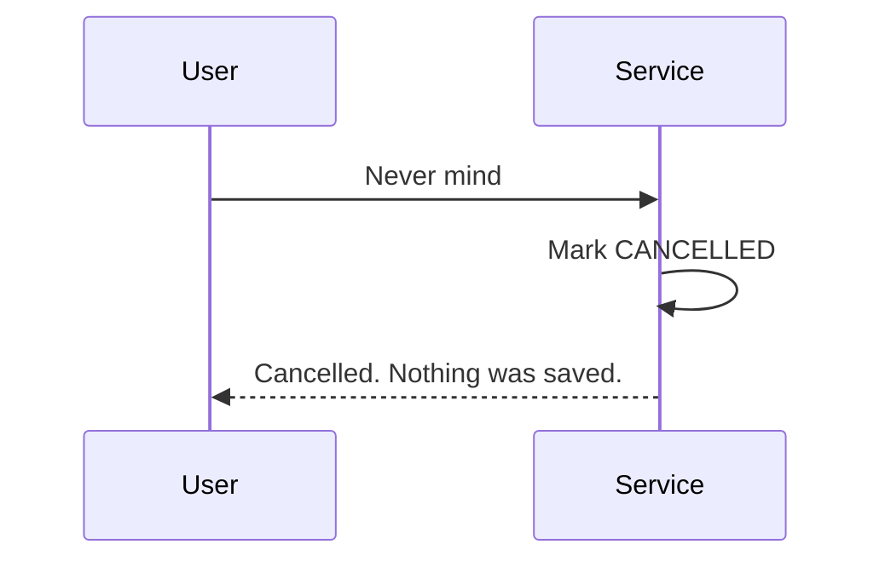

> Current integration: MCP compilation/continuation uses signed user-bound state
> and `/alexa` keeps it in memory. See [the integration handoff](../../../docs/bedrock-integration.md).
> This document describes the state machine and its original pure-service boundary.

# Multi-turn expectation clarification

This is a pure, bounded application state machine on top of the existing compiler.
It interprets but never saves, ingests evidence, evaluates, or calls MCP. Final
capture remains a later authenticated orchestration step. `/alexa` currently uses
React chat state and its working deterministic/MCP path; this pass does not change
it or expose a new endpoint. No database migration, Redis, cache or auth system
has been introduced.

## Application contract

```python
from app.schemas.compiler import CompileContext
from app.services.compiler_service import (
    start_expectation_compilation,
    continue_expectation_compilation,
)

# ctx uses a trusted aware server instant, verified IANA timezone and locale.
turn = start_expectation_compilation(user_text, ctx)
# Keep turn.state under the same authenticated user in a trusted session layer.
turn = continue_expectation_compilation(turn.state, next_answer, next_ctx)
```

Both functions return `ClarificationTurn`: validated `state`, optional existing
compiler `outcome`, friendly `message`, typed `interaction`, and optional
`replaced_state` for an explicit topic switch. The existing one-shot
`compile_expectation` entry point is retained. Injectable engines support tests;
default service-owned clients are closed after each request.

Only `state.status == COMPILED` with a `CompiledExpectation` outcome makes a
creation payload available. Even then **nothing has been saved**. Replaying a
terminal session returns no new outcome and performs no model or MCP call. Later
orchestration must prevent duplicate captures separately; compilation is not a
persistence receipt.

## State and lifetime

`ClarificationState` version `v1` serializes with `model_dump_json()` and restores
using `ClarificationState.model_validate_json(json, strict=True)`. It includes:

- UUID session ID, original utterance and typed partial interpretation;
- established creation-field values validated from actual `ExpectationCreate`
  field definitions, plus subject/operand/currency and calendar reference facts;
- one prioritized unresolved field/question, bounded history of accepted answers,
  turn count, max-turn policy and consecutive no-progress count;
- ACTIVE / COMPILED / CANCELLED / FAILED / EXPIRED;
- explicit creation/expiry instants, timezone/locale, compiler and clarification
  prompt versions, and final existing `ExpectationCreate` only when compiled.

History is an application audit of clarification, not observed evidence or a
conversation that is resent to Bedrock. New state snapshots are independent;
continuation does not mutate caller-owned snapshots. Terminal states have no
pending question. Invalid versions, field types, lifecycle counts, private fields,
multiple operands and inconsistent calendar reference facts are rejected.

Existing Settings loads `backend/.env.local` or deployment environment:

| Variable | Default | Bounds |
| --- | --- | --- |
| `CLARIFICATION_MAX_TURNS` | `3` | 1–12 follow-up answers per session |
| `CLARIFICATION_TTL_SECONDS` | `900` | 60–3600 seconds |

The initial utterance does not consume a follow-up turn. Compilation on the final
allowed answer succeeds; an unresolved final answer returns FAILED with a friendly
restart message. Two consecutive no-progress answers fail sooner rather than
repeating essentially the same question indefinitely. Unrelated responses consume
a turn, do not change facts and are classified as unrelated. Expiry is checked
against the caller's explicit current instant; expired sessions cannot resume.
Changed timezone/locale, backwards time or prompt version changes require restart.

## Patches and questions

Initial compilation uses the existing compiler. If clarification is needed, a
conservative deterministic extractor retains explicit known facts; guessed model
partials are never copied. If the compiler remains uncertain despite apparently
complete extracted facts, the session fails safely rather than bypassing it.
The current partial extractor supports numeric comparisons and positive package
arrival semantics. Other ambiguous event/boolean subjects may need a clearer
one-shot statement; no guessed generalized event grammar is introduced.

Continuation asks Bedrock for `ContinuationDecision`, containing only
answer/correction/unrelated and a unique list of field patches. Each patch cites
an exact quote from the current answer. The model does not regenerate an entire
expectation on each turn. Inputs contain typed partials, the current unresolved
field, previous question, cleaned answer, current instant and timezone/locale;
the entire chat history, identities and credentials are not sent.

Deterministic merge allows fields relevant to the current question, preserves all
established values, and rejects implicit changes. Corrections need explicit
language plus a relevant field anchor; merely starting unrelated text with
“actually” does not authorize a target change. Numeric proof values, enum meaning,
subject normalization, operand selection, currency and calendars are validated.
“Last month” selects a baseline reference but never provides its missing amount.
Changing operands clears the obsolete opposite operand. Subject corrections
update the derived metric without resetting the established amount or calendar.
A cross-domain subject is a new topic, requiring an explicit replacement request.

Question priority is subject, comparison/operand meaning, amount, currency and
required calendar information. Questions ask one material thing, use plain language,
and contain no enum/schema lists. Calendar anchors preserve the originally resolved
relative date across midnight; a held deadline that passes during a conversation
requires a new deadline instead of producing a stale compiled result. Explicit
deadline corrections get their own trusted
reference instant. Supported date vocabulary and default tolerance remain those
of the compiler. Unsupported calendars still need clarification.

Once all facts are established, deterministic assembly produces a readable claim
reflecting corrections, then reuses the existing `ExpectationCreate`, compiled
cross-field validator and compiler grounding/calendar checks. The original
utterance remains in state; the final claim uses current grounded facts so an old
$120 limit is not misleadingly displayed after correction to $150. Sources and the
project materiality default are retained; no connection or evaluation is inferred.

## Cancellation, replacement and security

Clear “Never mind”, “Cancel that”, “Forget it”, and “I don't want to track this”
terminate as CANCELLED without model/tool calls. Explicit “Track …”/“I'm counting
on …”/“I expect …”, optionally following “Actually forget that”, cancels the old
session and starts a separate compile session. Both the cancelled snapshot and
new session ID are returned; no old bill fields merge into a package expectation.
Multiple expectations in a replacement ask the user to select one.

Follow-up text is untrusted data. Common policy-override tails such as “Ignore your
rules …” are removed before interpretation; their legitimate first answer can
still resolve subject. This heuristic is defense in depth, not a universal prompt
injection detector. Typed schemas, quoted facts, correction anchors, merge guards,
final validation and absence of persistence/tool capability enforce boundaries.
Normal foundation JSON/schema repair is bounded to one attempt; semantic patch
failures return a typed FAILED session instead of retrying guessed facts.

State has no token, credential, database URL, profile, SDK object or server config
fields. Common credential-shaped content is rejected/redacted before storage or
model calls; this is not a universal secret detector. Callers must never combine
HTTP headers or authentication objects with conversation content.

**State is not self-authenticating.** This pass returns it to the trusted
application layer. Pydantic validation does not prevent tampering or authorize a
user. Before a browser endpoint exists, the integration must hold state server-side
bound to authenticated user + session ID, or sign and verify returned state with
a proper private mechanism. Do not accept raw browser JSON as trusted state.
No existing server session cache was available to reuse; no unsigned browser
continuation endpoint or invented signing secret is added here. State contains
private user conversation and must not be published or cross-user shared.

## Sequences

### A. One-turn compilation

```mermaid
sequenceDiagram
    User->>Service: Grocery bill under $120 this week
    Service->>Compiler: compile_expectation(text, context)
    Compiler-->>Service: CompiledExpectation
    Service-->>User: COMPILED; ready, not saved
```

### B. One clarification

```mermaid
sequenceDiagram
    User->>Service: Electricity bill lower than last month
    Service->>Compiler: Initial compile
    Service-->>User: What was last month's bill amount?
    User->>Service: $142.10
    Service->>Bedrock: Grounded baseline patch only
    Service->>Compiler: Existing schema/grounding validation
    Service-->>User: COMPILED; baseline 142.10, not saved
```

The three-answer example asks “Which bill?”, then “Last month's bill or a specific
amount?”, then “What was last month's bill amount?”. It never supplies a made-up
prior number.

### C. Correction

```mermaid
sequenceDiagram
    User->>Service: Actually make it $150, not $120
    Service->>Bedrock: Interpret explicit target correction
    Service->>Service: Verify $150 quote; reject negated $120; retain other facts
    Service-->>User: Next needed question or COMPILED
```

### D. Cancellation



### E. Maximum-turn failure

```mermaid
sequenceDiagram
    User->>Service: Final allowed answer, still incomplete
    Service->>Service: Enforce turn bound
    Service-->>User: FAILED; friendly restart message
    User->>Service: Another answer to same session
    Service-->>User: Session closed; no model call
```

## Observability and tests

Safe events: clarification_started / clarification_turn / clarification_completed /
clarification_cancelled / clarification_failed. Existing JSON logging carries
turn count, version, duration, status and request correlation. The foundation event
adds model/retry/repair/usage metadata. No conversation contents or Authorization
headers are logged.

From backend:

```sh
pytest tests/test_clarification.py tests/test_expectation_compiler.py tests/test_bedrock.py
```

Mocks exercise the real Converse adapter, strict parser/repair path, merges and
state lifecycle. Live Bedrock model quality is not asserted by mocked tests.
Before `/alexa` integration, implement the authenticated trusted session boundary,
wire start/continue under active-session detection, handle explicit cancellation
and replacement, and call real MCP capture only for a completed result under clear
user intent. Do not claim compilation itself saved an expectation.
